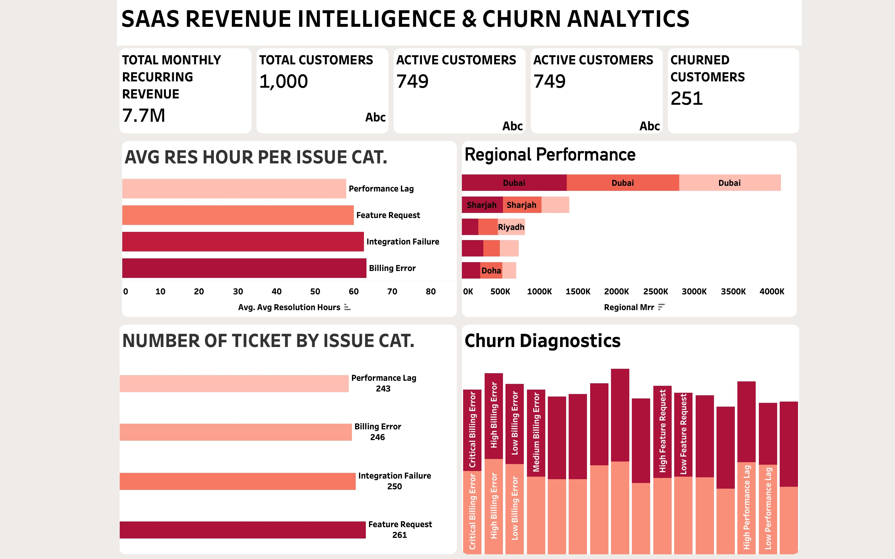

# 📊 SaaS Revenue Intelligence & Churn Analytics Platform

An enterprise-grade modern data stack platform built using **Snowflake (Layered Architecture)** and visualized via an **Executive SaaS & Churn Dashboard Suite**. This project processes subscription and operational support logs, transforming raw data into dimensional models tracking **$7.7M MRR**, active versus churned customer behavior, and regional revenue performance.

---

## 🏗️ Architecture & Data Flow
The data pipeline follows a structured layered architecture inside Snowflake, managed through a cost-controlled development warehouse (`ECOM_DEV_WH`):

* **Raw Layer (`RAW_schema`):** Flexible raw ingestion tables for subscribers, subscriptions, and support tickets via an internal CSV stage (`SAAS_RAW_DATA`) with fault-tolerant error handling (`ON_ERROR = 'CONTINUE'`).
* **Staging Views (`STG_schema`):** Data cleaning and normalization views applying string trimming (`TRIM`), casing standardizations (`LOWER`, `INITCAP`), and missing value defaults (`COALESCE`).
* **Gold Layer (`GOLD_schema`):** Dimensional modeling (Star Schema) consisting of conformed dimensions (`DIM_CUSTOMERS`, `DIM_SUBSCRIPTIONS`) and granular fact tables (`FACT_SUPPORT_TICKETS`) utilizing surrogate keys and foreign key relationships.
* **Analytical Serving Layer (`ANALYTICS_schema`):** Advanced SQL reporting views powering high-level executive KPIs, regional revenue breakdowns, and operational churn diagnostics.

---

## 📊 Executive Dashboard Preview
The analytical views power a multi-faceted executive intelligence suite covering core SaaS and revenue retention metrics:

* **Revenue Intelligence & Churn Suite:** Evaluates platform scale (**$7.7M Total MRR**, **1,000 Total Customers**, **749 Active**, **251 Churned**)[cite: 10], analyzes ticket resolution times across issue categories (*Performance Lag, Feature Request, Integration Failure, Billing Error*), maps regional performance across international markets (*Dubai, Sharjah, Riyadh, Doha*), and runs deep churn diagnostics[cite: 10].
  

---

## 🛠️ Technical Highlights & Engineering Practices
* **Cost-Optimized Infrastructure:** Configured a custom Snowflake warehouse (`ECOM_DEV_WH`) utilizing an `XSMALL` size, 5-minute auto-suspend, and an economy scaling policy.
* **Defensive Pipeline Engineering:** Implemented fault-tolerant bulk copying (`COPY INTO`) with robust null-value handling and clean staging transformations.
* **Dimensional Modeling & Integrity:** Built relational star schema models linking natural business keys to auto-incrementing surrogate keys (`CUSTOMER_KEY`, `SUBSCRIPTION_KEY`) for high-performance analytical querying.

---

## 📂 Repository Structure
```text
saas-revenue-churn-analytics/
│
├── ASSETS/                          # Dashboard screenshots
│   └── SAAS_DASHBOARD.jpeg
│
├── sql/                             # Modular SQL scripts
│   ├── WAREHOUSE_AND_DATABASE.sql
│   ├── RAW_INGESTION.sql
│   ├── STAGING_VIEWS.sql
│   ├── GOLD_STAR_SCHEMA.sql
│   └── ANALYTICS_SERVING_VIEWS.sql
│
└── README.md
